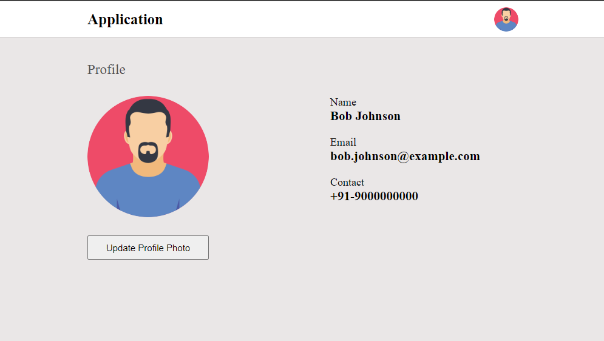

# React app
This is an application which uses the custom redux store library `redux-lib` to implement state management.

## Installation
1. **Install Dependencies**: Run `npm install` to install the required dependencies.
2. **Run the app**: Run `npm run dev` to run the application.

## Preview

## Usage
1. Click on "Upload Profile Photo" button.
2. Select a photo from the local file system.
3. The new photo will be reflected on the profile page and right portion of the navbar.